# Membuat Table Database

1. Membuat file dengan nama koneksi.php

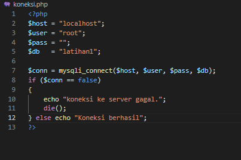

Jika koneksi database berhasil, maka akan ada perintah " Koneksi berhasil "
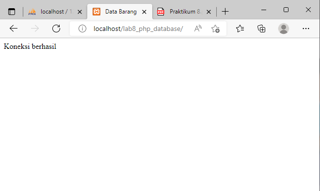

2. Buat file dengan nama index.php

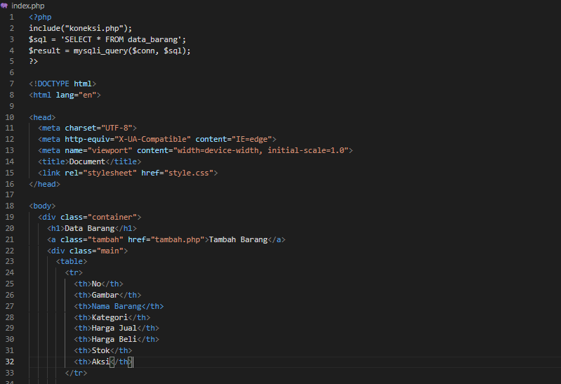

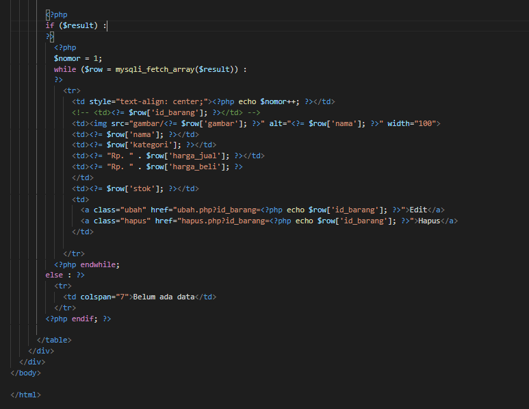

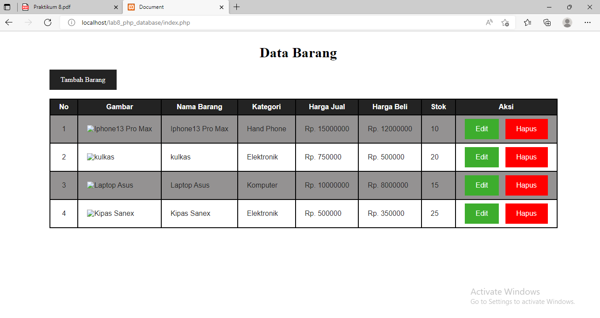

3. Buat file dengan nama tambah.php (untuk menambah data)

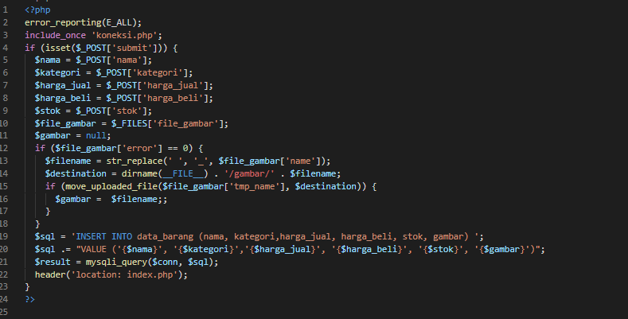

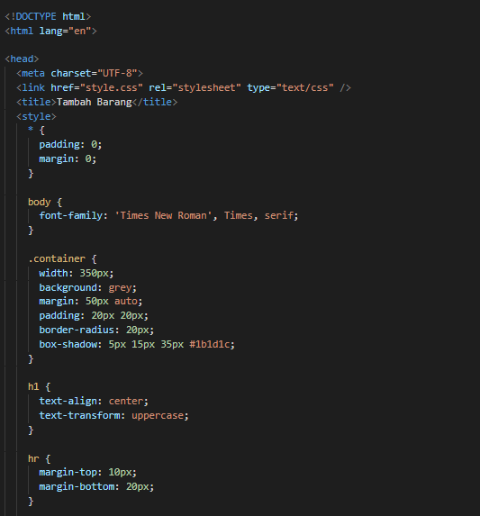

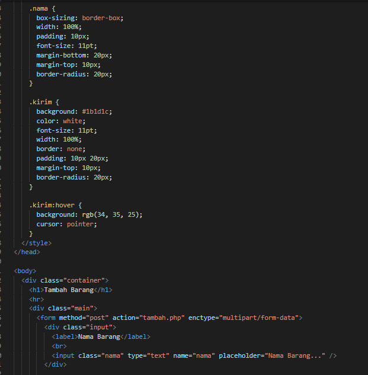

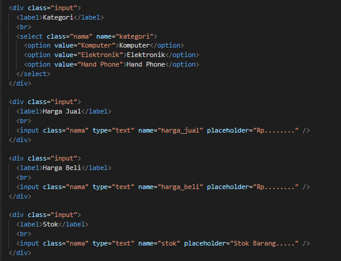

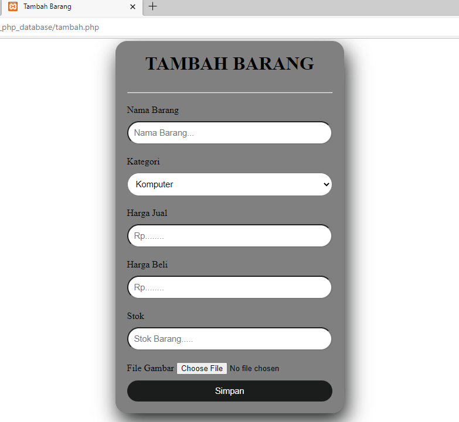

4. Mengubah data & buat file dengan nama ubah.php

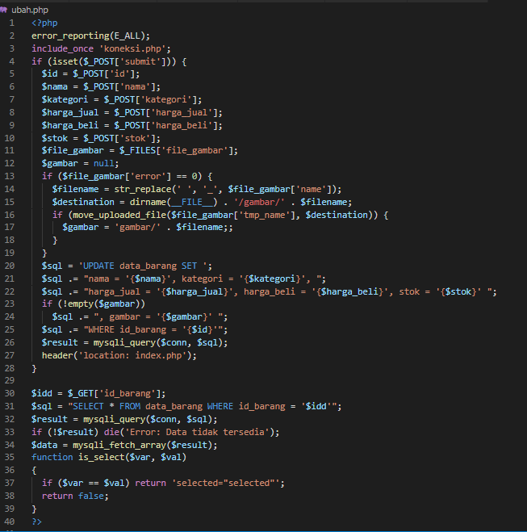

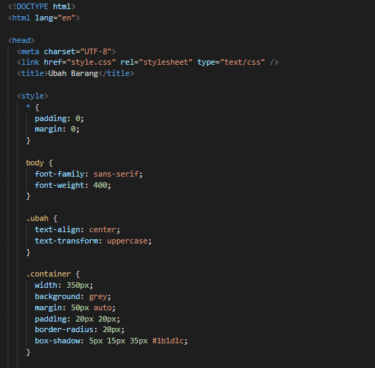

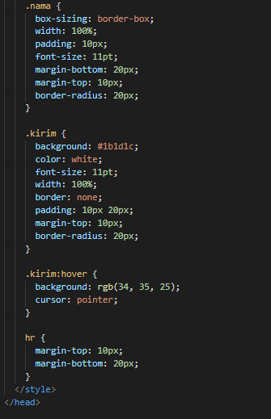

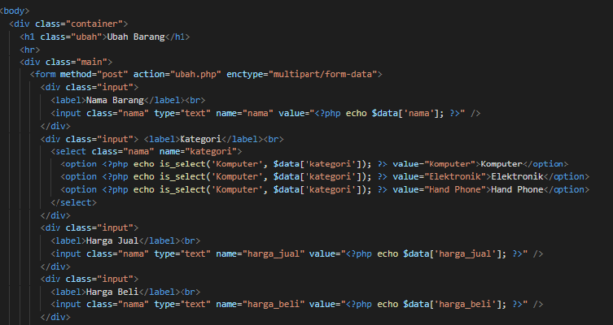

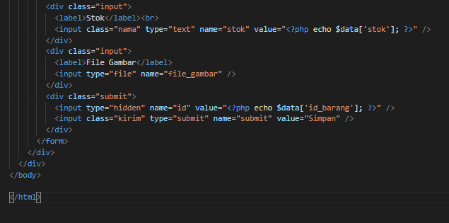

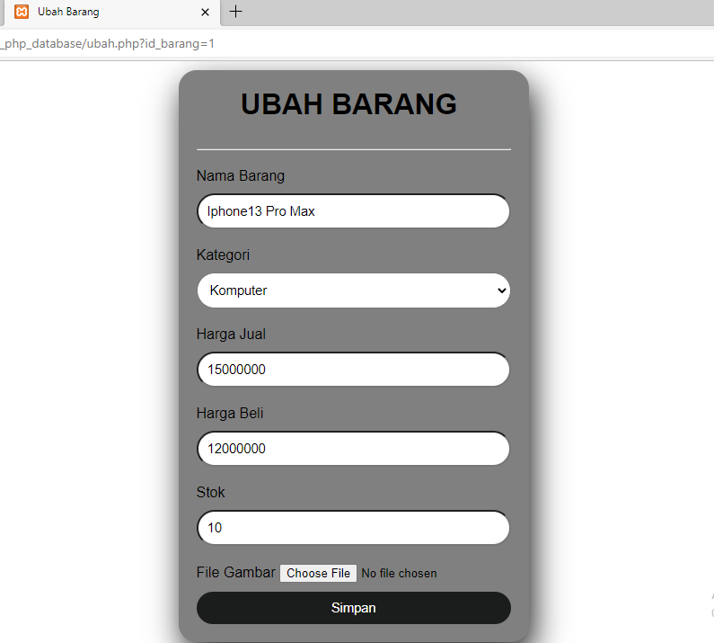

5. Menghapus data

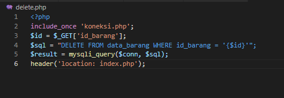

6. Kode CSS

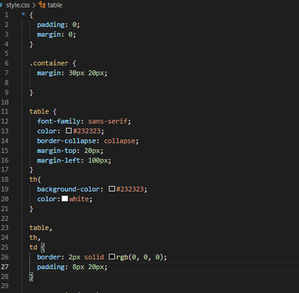

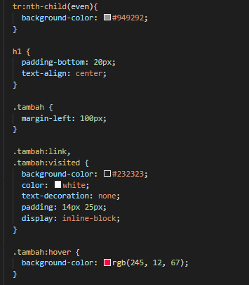

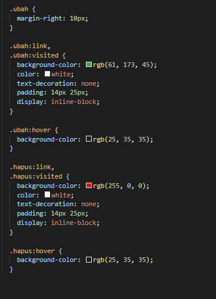