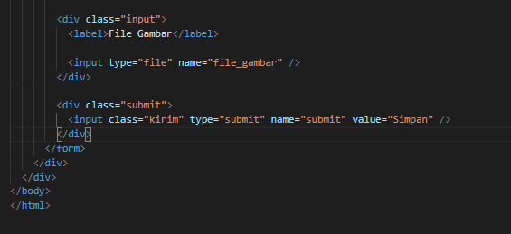

# Membuat Table Database

1. Membuat file dengan nama koneksi.php

Jika koneksi database berhasil, maka akan ada perintah " Koneksi berhasil "

2. Buat file dengan nama index.php

3. Buat file dengan nama tambah.php (untuk menambah data)

4. Mengubah data & buat file dengan nama ubah.php

5. Menghapus data

6. Kode CSS

